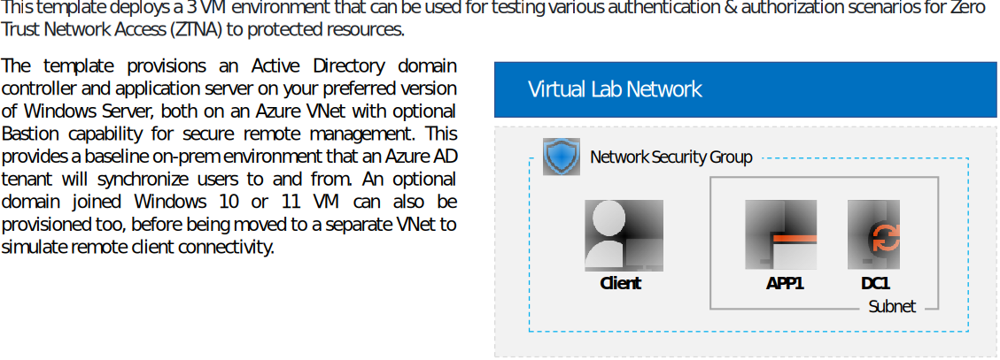

Last updated 21/03/2023

#  Entra ZTNA Lab - 3 VM Topology 

**Time to deploy**: Approx. 40 minutes

<a href="https://portal.azure.us/#create/Microsoft.Template/uri/https%3A%2F%2Fraw.githubusercontent.com%2FRainier-MSFT%2FEntra_ZTNA_Lab%2Fmain%2FBase-config_3-vm%2Fazuredeploy.json" target="_blank">

<a/>

## Azure Resources
The following ARM resources are deployed as part of the solution:

### VMs
+ **AD DC VM**: Windows Server 2016, 2019, or 2022 VM configured as a domain controller with DNS & Certificate services. Choice of Azure AD Connect sync or Cloud sync installers are placed on the desktop to setup a sync to an Azure AD tenant, and so is a link to download an Azure AD Application proxy connector
+ **App Server VM**: Windows Server 2016, 2019, or 2022 VM that can be joined to any Windows Active Diretory (AD) domain. IIS 10 and .NET 4.5 are installed and several test apps are pre-configured for IWA, forms, and header based authentication. The directory C:\Files containing the file example.txt is shared as "\\APP1\Files" with full control for domain accounts. iPerf is also installed for network performance testing.
+ **Client VM**: Optional Windows 10 or 11 client joined to the AD domain

### Storage
+ **Storage account**: For diagnostics and client VM if needed, but AD DC and App Server VMs use managed disks, so otherwise not required

### Networking
+ **NSG**: Network security group is configured to deny all inbound connectivity with the exception of RDP 3389, but allows outbound Internet connectivity without restrictions
+ **Virtual network**: Azure VNet for internal traffic, configured as 10.0.0.0/22 and with custom DNS pointing to the AD DC's private IP address. Internal Subnet is defined as 10.0.0.0/24 for a total of 249 available IP addresses and Bastion subnet as 10.0.1.0/26
+ **Network interfaces**: 1 NIC per VM, all with static private IPs
+ **Public IP addresses**: VMs are only provisioned with an optional static public IP for remote management, if chosen during deployment

### Extensions
+ Each member VM uses the **JsonADDomainExtension** extension to join the domain post Azure deployment
+ **BGInfo** displays session info on desktop wallpaper on all VMs, but only displays over direct RDP sessions and not over Azure Bastion
+ **Antimalware** is applied to all VMs with basic scheduled scan and exclusion settings
+ **CustomExtension** is used to apply a set of common configs such as enabling TLS1.2 for .Net, disabling IE ESC, relaxing UAC, plus a bunch of extras specific to each VM's role. E.g. IIS & test services ont the App VM, Azure AD Connect links on DC VM, etc

### Management
Once deployed, VMs can be administered thru either of the following:

+ **RDP** is enabled on all VMs, but can only be used for direct remote management if provisioned with a public IP either during or after deployment
+ **Azure Bastion** basic is also offered as an alternative to managing the VMs via a direct RDP connection 

**Note:** Don't forget to log into the VM using the domain admin account, not the local admin. I.e. <domain_admin>@<your_domain>
 

## Deployment
The environment can be deploy'd in one of two ways:

+ Click the "Deploy to Azure" button to open the deployment UI in the Azure portal
+ From any computer, execute the Base-config_3-vm.ps1 powershell script found in the 'Resources

### Pre-requisites
Prior to deploying the template, have the following ready:

+ Access to an Azure subscription with sufficient resources to deploy the VM and associated resources
+ A DNS label prefix for the URL of the public IP addresse of your virtual machine. The FQDN will be formated as _\<DNS label prefix\>\<VM hostname\>.\<region\>.cloudapp.azure.com_. You'll enter this in the __Dns Label Prefix__ field after clicking the __Deploy to Azure__ button

### Client machine
Test clients can be deployed thru either of the following options of options, providing the machine is Hybrid Azure AD joined (HAADJ) or Azure AD Joined (AADJ) to the test Azure AD tenant:  
     
+ Physical computer - On a personal computers, install Windows 10 or 11 Enterprise
+ Virtual machine - Use your prefered hypervisor to create a Windows 10/11 Enterprise VM
+ Virtual machine in Azure - To create a Windows 10/11 virtual machine in Microsoft Azure, you must have a Visual Studio-based subscription, which has access to the images for Windows 10/11 Enterprise. Other types of Azure subscriptions, such as trial and paid subscriptions, do not have access to this image. For the latest information, see Use Windows client in Azure for dev/test scenarios. For more information about eligible subscriptions, see https://docs.microsoft.com/en-us/azure/virtual-machines/windows/client-images#subscription-eligibility
+ Virtual Machine in Azure Virtual Desktop (AVD) or Windows365 - See our docs https://learn.microsoft.com/en-us/windows-365/overview
     
**Note:** Enabling the option to deploy a client VM via this template requires that you upload a generalized Windows 10/11 VHD to an Azure storage account and provide the account name in the _clientVhdUri_ parameter. Note that SAS tokens are not supported, and the blob container must be configured for public read access. The path to the VHD should resemble the following example:

https://<storage account name>.blob.core.windows.net/vhds/<vhdName>.vhd

For more information about how to prepare a generalized VHD, see https://docs.microsoft.com/en-us/azure/virtual-machines/windows/prepare-for-upload-vhd-image.

     

<b><u>Additional Notes</u></b>

<li> Guest OS configuration is executed using DSC & custom extensions thru AppConfig.ps1.zip & Common_Configs.ps1 resources</li>
<li> A *User1* domain account is created and added to the Domain Admins group. The password is the same as provided in the *adminPassword* parameter during deployment
<li> The *App server* and *Client* VM resources depend on the **ADDC** resource deployment in order to ensure that the AD domain exists prior to execution of 
the JoinDomain extensions for the member VMs. This asymmetric VM deployment process adds several extra minutes to the overall deployment time
<li> The private IP address of the **ADDC** VM is always *10.0.0.10*. This IP is set as the DNS IP for the virtual network and all member NICs
<li> Deployment outputs include public IP address and FQDN for each VM
<li> The default VM size for the VM in the deployment is Standard_B2s, but can be changed
<li> When the specified VM size is smaller than DS4_v2, the client VM deployment may take longer than expected, and then may appear to fail. The client VMs and extensions may or may not deploy successfully. This is due to an ongoing Azure client deployment bug, and only happens when the client VM size is smaller than DS4_v2.

