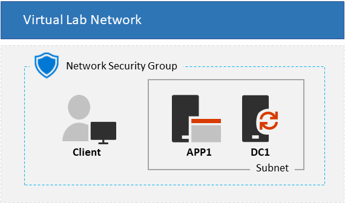

#  Entra ZTNA Lab - 3 VM Topology 

**Time to deploy**: Approx. 40 minutes 
21/03/2023

<a href="https://portal.azure.us/#create/Microsoft.Template/uri/https%3A%2F%2Fraw.githubusercontent.com%2FRainier-MSFT%2FEntra_ZTNA_Lab%2Fmain%2FBase-config_3-vm%2Fazuredeploy.json" target="_blank">

<a/>

#### 
This template deploys a 3 VM hybrid environment that can be used for testing various authentication & authorization scenarios for Zero Trust Network Access (ZTNA) to protected resources. The template provisions an Active Directory domain controller and application server on your preferred version of Windows Server, both on an Azure VNet with optional Bastion capability for secure remote management. This provides a baseline on-prem environment that an Azure AD tenant will synchronize users to and from. An optional domain joined Windows 10 or 11 VM can also be provisioned too, before being moved to a separate VNet to simulate remote client connectivity

+ **AD DC VM**: Windows 2016, 2019, or 2022 VM configured as a domain controller with DNS & Certificate services. Cloud sync is installed to sync to an Azure AD, plus a link to download an Azure AD Application proxy connector is on the desktop
+ **App Server VM**: Windows 2016, 2019, or 2022 VM joined to the AD domain. IIS 10 and .NET 4.5 are installed, with several test apps pre-configured for IWA, forms, and header based authentication. The directory C:\Files contains an example.txt file, shared as "\\APP1\Files" with full control for domain accounts. iPerf is also installed for net perf testing.
+ **Client VM**: Optional Windows 10 or 11 client joined to the AD domain

### Storage
+ **Storage account**: AD DC and App Server use managed disks, so only used for diags and storing your own client image if necessary 

### Networking
+ **NSG**: Network security group is configured to deny all inbound connectivity with the exception of RDP 3389, but allows outbound Internet connectivity without restrictions
+ **Virtual network**: Azure VNet for internal traffic, configured as 10.0.0.0/22 and with custom DNS pointing to the AD DC's private IP address. Internal Subnet is defined as 10.0.0.0/24 for a total of 249 available IP addresses and Bastion subnet as 10.0.1.0/26
+ **Network interfaces**: 1 NIC per VM, all with static private IPs
+ **Public IP addresses**: VMs are only provisioned with an optional static public IP for remote management, if chosen during deployment

### Extensions
+ Each member VM uses the **JsonADDomainExtension** extension to join the domain post Azure deployment
+ **BGInfo** displays session info on desktop wallpaper on all VMs, but only displays over direct RDP sessions and not over Azure Bastion
+ **Antimalware** is applied to all VMs with basic scheduled scan and exclusion settings
+ **CustomExtension** is used to apply a set of common configs such as enabling TLS1.2 for .Net, disabling IE ESC, relaxing UAC, plus a bunch of extras specific to each VM's role. E.g. IIS & test services ont the App VM, Azure AD Connect links on DC VM, etc

### Management
Once deployed, VMs can be administered thru either of the following:

+ **RDP** is enabled on all VMs, but can only be used for direct remote management if provisioned with a public IP either during or after deployment
+ **Azure Bastion** basic is also offered as an alternative to managing the VMs via a direct RDP connection 

**Note:** Don't forget to log into the VM with the domain admin account, not the local admin. I.e. Use <domain_admin>@<your_domain>
 

## Deployment
The environment can be deployed through one of two ways:

+ Click the "Deploy to Azure" button to launch the deployment UI in Azure
+ From any computer, execute the Base-config_3-vm.ps1 powershell script located in the 'Resources folder

Entra Cloud Sync is pre-installed on the DC and just needs running through to point to your Azure AD tenant.

Any remaining manual steps to complete configuring the environment are in the Finalise.txt file on the desktop of each VM

### Pre-requisites
Prior to deploying the template, have the following ready:

+ Access to an Azure subscription with sufficient resources to deploy VMs and associated resources
+ Azure AD Premium licences to test with Entra Conditional Access and Global Secure Access
+ If enabling public IPs, you'll also need to specify a DNS hostname prefix for public FQDN of each virtual machine. The FQDN will be formated as _\<DNS label prefix\>\<VM hostname\>.\<region\>.cloudapp.azure.com_. You'll enter this in the __Dns Label Prefix__ field after clicking the __Deploy to Azure__ button and can be used to connect to VMs directly via RDP

### Client machine
A Windows 10/11 test client VM is also offered through the template, but other options do also exist:
     
+ Physical computer - Install Windows 10 or 11 Enterprise
+ On-prem VM - Use your prefered hypervisor to create a Windows 10/11 Enterprise VM
+ Cloud VM - Create a Windows 10/11 VM in any vendor cloud. If in Azure, you must have a full Azure subscription or else a Visual Studio-based subscription with access to the Windows 10/11 Enterprise images. Azure trial subscriptions and some paid subscriptions may not have access to these images. For the latest information see https://docs.microsoft.com/en-us/azure/virtual-machines/windows/client-images#subscription-eligibility
+ Virtual Machine in Azure Virtual Desktop (AVD) or Windows365 - See our docs https://learn.microsoft.com/en-us/windows-365/overview
     
**Note:** Uploading a generalized Windows 10/11 VHD to an Azure storage account and provide the account name in the _clientVhdUri_ parameter. Note that SAS tokens are unsupported and the blob container must be configured for public read access. The path to the VHD should resemble the following example: https://<storage account name>.blob.core.windows.net/vhds/<vhdName>.vhd

In either case, the client machine must be either Hybrid Azure AD joined (HAADJ) or Azure AD Joined (AADJ) to the test Azure AD tenant.

     

<b><u>Additional Notes</u></b>

<li> Guest OS configuration is executed using combination of DSC, custom extensions, and thru XConfigs.ps1</li>
<li> A *User1* domain account is created and added to the Domain Admins group. The password is the same as provided in the *adminPassword* parameter during deployment
<li> The *App server* and *Client* VM resources depend on the **AD DC** resource deployment in order to ensure that the AD domain exists prior to execution of 
the JoinDomain extensions for the member VMs. This asymmetric VM deployment process adds several extra minutes to the overall deployment time
<li> The private IP address of the **AD DC** is always *10.0.0.10*. This IP is set as the DNS IP for the virtual network and all member NICs
<li> Deployment outputs include public IP address and FQDN for each VM
<li> The default VM size for the VM in the deployment is Standard_B2s, but can be changed
<li> If the specified VM size is smaller than DS4_v2, the client VM deployment may take longer than expected and may appear to fail. The client VMs and extensions may or may not deploy successfully. This is due to an ongoing Azure client deployment bug, and only happens when the client VM size is smaller than DS4_v2.

