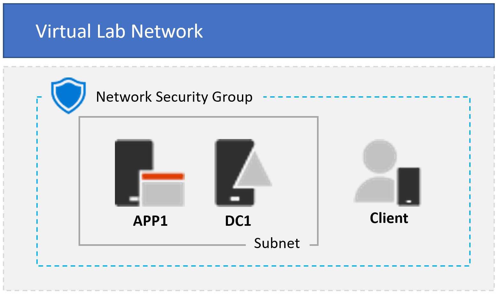

Last updated 21/03/2023

# Entra ZTNA Lab - 3 VM Topology                                                                                                       

**Time to deploy**: Approx. 15 minutes

This template deploys a **3 VM base configuration** for setting up a virtual pre-production enviroment that can be used for testing various authentication & authorization scenarios for Zero Trust Network Access (ZTNA) to protected resources.

The template provisions an Active Directory domain controller and application server on your prefered version of Windows Server, both on an Azure VNet with optional Bastion capability for secure morete management. This provides a baseline on-prem enviroment that an Azure AD tenant will synchonise users to and from. An optional Windows 10 or 11 client VM is also provisioned and domain joined too, before being moved to a seperate VNet to simulate remote client connectivity.

## Azure Resources

The following ARM resources are deployed as part of the solution:

### VMs
+ **AD DC VM**: Windows Server 2016, 2019, or 2022 VM configured as a domain controller and DNS with static private IP address
+ **App Server VM**: Windows Server 2016, 2019, or 2022 VM joined to the domain. IIS 10 and .NET 4.5 are installed, and the directory C:\Files containing the file example.txt is shared as "\\APP1\Files" with full control for the User1 domain account
+ **Client VM**: Optional Windows 10 or 11 client joined to the AD domain

### Storage
+ **Storage account**: Diagnostics storage account, and client VM storage account if indicated. AD DC and App Server VMs in the deployment use managed disks, so no storage accounts are created for VHDs

### Networking
+ **NSG**: Network security group configured to allow inbound RDP on 3389
+ **Virtual network**: Azure VNet for internal traffic, configured as 10.0.0.0/22 and with custom DNS pointing to the AD DC's private IP address. Internnal Subnet is defined as 10.0.0.0/24 for a total of 249 available IP addresses and Bastion subnet as 10.0.1.0/26
+ **Network interfaces**: 1 NIC per VM
+ **Public IP addresses**: 1 static public IP per VM. Note that some subscriptions may have limits on the number of static IPs that can be deployed for a given region

### Extensions
+ **JoinDomain**: Each member VM uses the **JsonADDomainExtension** extension to join the domain
+ **BGInfo**: The **BGInfo** extension is applied to all VMs, but will not display over RDP sessions that have the wallpaper disabled
+ **Antimalware**: The **iaaSAntimalware** extension is applied to all VMs with basic scheduled scan and exclusion settings
     
## Deployment
You can deploy the environment in one of two ways:

+ Click the "Deploy to Azure" button to open the deployment UI in the Azure portal
+ Execute the PowerShell script at https://raw.githubusercontent.com/Rainier-MSFT/Entra_ZTNA_Lab/main/Base-config_3-vm/scripts/Deploy-Base-config_3-vm.ps1 on your local computer

### Pre-requisites
Prior to deploying the template, have the following information ready:

+ A DNS label prefix for the URLs of the public IP addresses of your virtual machines. These FQDNs are generated for each virtual machine in your deployment using format _\<DNS label prefix\>\<VM hostname\>.\<region\>.cloudapp.azure.com_. Enter this label in the __Dns Label Prefix__ field after clicking the __Deploy to Azure__ button or for the value of the __dnsLabelPrefix__ variable in the template parameters file

### Client machine
Test clients can be deployed thru either of the following options of options, providing the machine is Hybrid Azure AD joined (HAADJ) or Azure AD Joined (AADJ) to the test Azure AD tenant.   
     
+ Physical computer - On a personal computers, install Windows 10 or 11 Enterprise. You can download the Windows 10 Enterprise trial here.

+ Virtual machine - Use your prefered hypervisor to create a Windows 10/11 Enterprise VM. You can download the Windows 10 Enterprise trial here.

+ Virtual machine in Azure - To create a Windows 10/11 virtual machine in Microsoft Azure, you must have a Visual Studio-based subscription, which has access to the images for Windows 10/11 Enterprise. Other types of Azure subscriptions, such as trial and paid subscriptions, do not have access to this image. For the latest information, see Use Windows client in Azure for dev/test scenarios. For more information about eligible subscriptions, see https://docs.microsoft.com/en-us/azure/virtual-machines/windows/client-images#subscription-eligibility.
     
**Note:** Enabling the option to deploy a client VM via this template requires that you upload a generalized Windows 10/11 VHD to an Azure storage account and provide the account name in the _clientVhdUri_ parameter. Note that SAS tokens are not supported, and the blob container must be configured for public read access. The path to the VHD should resemble the following example:

     https://<storage account name>.blob.core.windows.net/vhds/<vhdName>.vhd

For more information about how to prepare a generalized VHD, see https://docs.microsoft.com/en-us/azure/virtual-machines/windows/prepare-for-upload-vhd-image.
        
## Additional notes

  
Expand

<li> All guest OS configuration is executed with DSC, using the resources CreateADPDC.ps1.zip and AppConfig.ps1.zip</li>
<li>The domain user *User1* is created in the domain and added to the Domain Admins group. User1's password is the one you provide in the *adminPassword* parameter
<li> The *App server* and *Client* VM resources depend on the **ADDC** resource deployment in order to ensure that the AD domain exists prior to execution of 
the JoinDomain extensions for the member VMs. This asymmetric VM deployment process adds several minutes to the overall deployment time
<li> The private IP address of the **ADDC** VM is always *10.0.0.10*. This IP is set as the DNS IP for the virtual network and all member NICs
<li> The default VM size for all VMs in the deployment is Standard_B2s
<li> Deployment outputs include public IP address and FQDN for each VM
<li> When the specified VM size is smaller than DS4_v2, the client VM deployment may take longer than expected, and then may appear to fail. The client VMs and extensions may or may not deploy successfully. This is due to an ongoing Azure client deployment bug, and only happens when the client VM size is smaller than DS4_v2.

