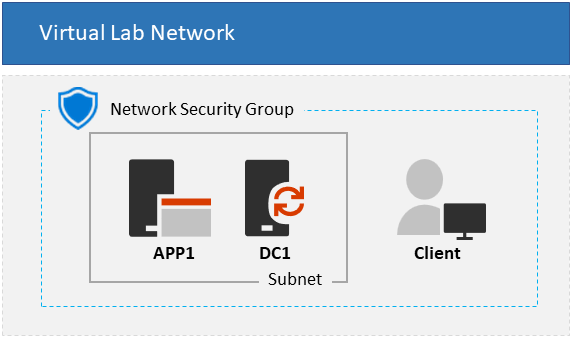

Last updated 21/03/2023

# Entra ZTNA Lab - 3 VM Topology                                                                                                       

**Time to deploy**: Approx. 40 minutes (15 mins for VM deployments and nnn )

This automation deploys a **3 VM configuration** for setting up a virtual pre-production enviroment that can be used for simulation testing authentication & authorization to ZTNA protected resources.

The **3 VM Base Configuration** template provisions a choice of Windows Server 2016, 2019, or 2022, as an Active Directory domain controller using your specified domain name, an application server also running Windows Server, and optionally a Windows 10 or 11 client VM. This provides the on-prem enviroment that an Azure AD tenant will synchonise users to and from.

**Note:** Choosing to deploy a client VM requires that you upload a generalized Windows 10/11 VHD to an Azure storage account and provide the account name in the _clientVhdUri_ parameter. Note that SAS tokens are not supported, and the blob container must be configured for public read access. The path to the VHD should resemble the following example:

     https://<storage account name>.blob.core.windows.net/vhds/<vhdName>.vhd

Use of a custom client image is required because the Windows 10 gallery image is only available in eligible subscriptions (Visual Studio or MSDN).

* For more information about eligible subscriptions, see https://docs.microsoft.com/en-us/azure/virtual-machines/windows/client-images#subscription-eligibility.
* For more information about how to prepare a generalized VHD, see https://docs.microsoft.com/en-us/azure/virtual-machines/windows/prepare-for-upload-vhd-image.

## Usage

You can deploy this template in one of two ways:

+ Click the "Deploy to Azure" button to open the deployment UI in the Azure portal
+ Execute the PowerShell script at https://raw.githubusercontent.com/Rainier-MSFT/Entra_ZTNA_Lab/main/Base-config_3-vm/scripts/Deploy-TLG.ps1 on your local computer.

Prior to deploying the template, have the following information ready:

+ A DNS label prefix for the URLs of the public IP addresses of your virtual machines. These URLs are generated for each virtual machine in your deployment in the format _\<DNS label prefix\>\<VM hostname\>.\<region\>.cloudapp.azure.com_. Enter this label in the __Dns Label Prefix__ field after clicking the __Deploy to Azure__ button or for the value of the __dnsLabelPrefix__ variable in the template parameters file.

## Solution overview

The following ARM resources are deployed as part of the solution:

+ **ADDC VM**: Windows Server 2016, 2019, or 2022 VM configured as a domain controller and DNS with static private IP address
+ **App Server VM**: Windows Server 2016, 2019, or 2022 VM joined to the domain. IIS 10 and .NET 4.5 are installed, and the directory C:\Files containing the file example.txt is shared as "\\APP1\Files" with full control for the User1 domain account.
+ **Client VM**: Windows 10 or 11 client joined to the domain
+ **Storage account**: Diagnostics storage account, and client VM storage account if indicated. ADDC and App Server VMs in the deployment use managed disks, so no storage accounts are created for VHDs.
+ **NSG**: Network security group configured to allow inbound RDP on 3389
+ **Virtual network**: Virtual network for internal traffic, configured with custom DNS pointing to the ADDC's private IP address and tenant subnet 10.0.0.0/8 for a total of 16,777,214 available IP addresses.
+ **Network interfaces**: 1 NIC per VM
+ **Public IP addresses**: 1 static public IP per VM. Note that some subscriptions may have limits on the number of static IPs that can be deployed for a given region.
+ **JoinDomain**: Each member VM uses the **JsonADDomainExtension** extension to join the domain.
+ **BGInfo**: The **BGInfo** extension is applied to all VMs.
+ **Antimalware**: The **iaaSAntimalware** extension is applied to all VMs with basic scheduled scan and exclusion settings.

## Solution notes

  
Expand

<li>All guest OS configuration is executed with DSC, using the resources CreateADPDC.ps1.zip and AppConfig.ps1.zip</li>
<li>The domain user *User1* is created in the domain and added to the Domain Admins group. User1's password is the one you provide in the *adminPassword* parameter
<li> The *App server* and *Client* VM resources depend on the **ADDC** resource deployment in order to ensure that the AD domain exists prior to execution of 
the JoinDomain extensions for the member VMs. This asymmetric VM deployment process adds several minutes to the overall deployment time
<li> The private IP address of the **ADDC** VM is always *10.0.0.10*. This IP is set as the DNS IP for the virtual network and all member NICs
<li> The default VM size for all VMs in the deployment is Standard_B2s
<li> Deployment outputs include public IP address and FQDN for each VM

     
## Known Issues

  
Expand

* When the specified VM size is smaller than DS4_v2, the client VM deployment may take longer than expected, and then may appear to fail. The client VMs and extensions may or may not deploy successfully. This is due to an ongoing Azure client deployment bug, and only happens when the client VM size is smaller than DS4_v2.

___
Developed by the **ZTNA CxP team** and sourced from the **Office 365 Commercial Content Experience team**.
